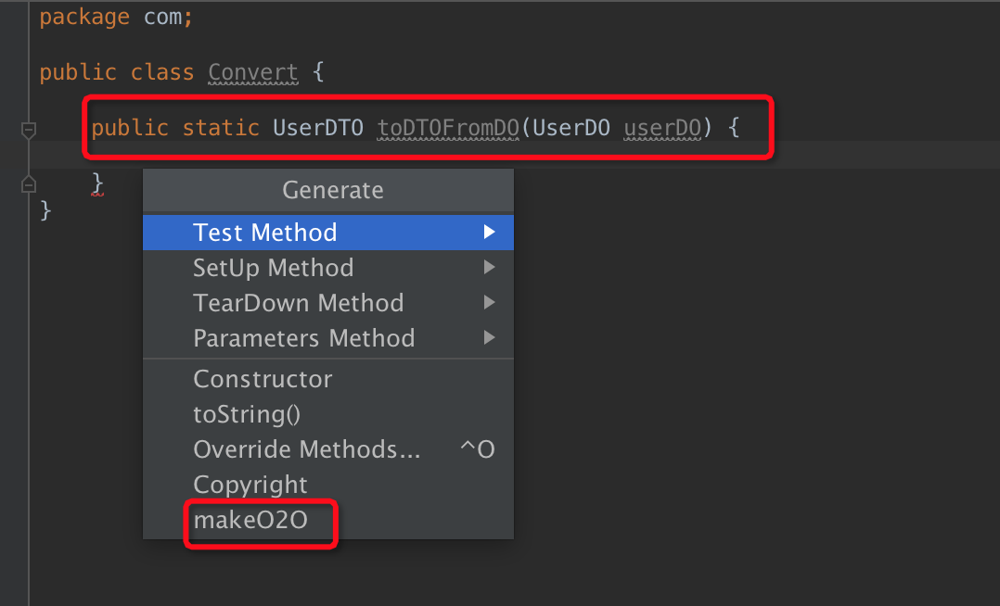
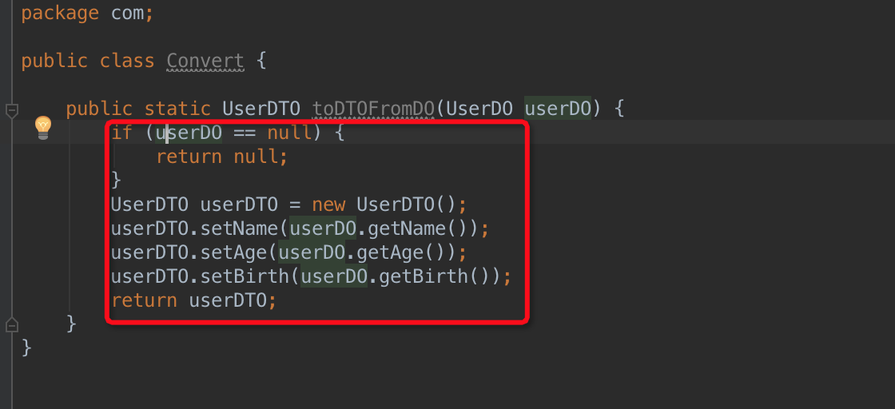

# 初衷

当我们开发一个大型项目时，系统往往会进行分层架构。从而不同层会产生不同的模型对象。
例如：DO、DTO、TO、VO等。所以此时我们难免会进行模型的转换。而这些模型，可能大部分字段
都是雷同的。当模型复杂，字段繁多时，转换代码就变得繁琐重复，真的像在搬砖一样。

# Beancopy原罪

于是，"懒惰"的程序员门开始找便捷方法。例如使用：
BeanUtils.copyProperties(sourceObj, targetObj);
这种方式固然简单，但也留下了不少的隐患。
1. 不同框架实现的copy功能对Boolean类型存在异议，导致无法copy
2. 属性名称一致，但类型不一致时，也无法copy，导致存在坑点
3. copy的性能毕竟还是差点没有原生的SetGet好

# Idea Plugin MakeO2O 横空出世

其实也没有技术含量，当你需要模型转换时，你只需要写一个空方法，入参出参，
由插件会帮你生产重复的SetGet代码。然后有不一致的情况下，你再进行微调就行。

# 教程

## 下载安装
目前暂时只支持手动安装，下载地址：

[下载](MakeO2O.jar)

## 简单使用
例如：我们系统里面有UserDTO、UserDO需要转换
我们只要先写方法签名，入参出参，然后按代码提示键盘，例如：Command + N
点击【makeO2O】

点击后，所有属性的SetGet转换代码就生成了，然后自己做一些微调就行

